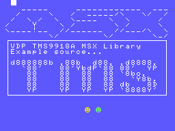
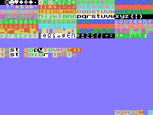

# VDP TMS9918A MSXBIOS SDCC Library (fR3eL Project)

<table>
<tr><td>Name</td><td>VDP_TMS9918A_MSXBIOS</td></tr>
<tr><td>Architecture</td><td>MSX</td></tr>
<tr><td>Format</td><td>C Object (SDCC .rel)</td></tr>
<tr><td>Programming language</td><td>C and Z80 assembler</td></tr>
<tr><td>Compiler</td><td>SDCC v4.4 or newer</td></tr>
</table>

 

## Description

Library with functions to work with the TMS9918A/28A/29A video processor.

It uses the functions from the MSX BIOS, so it is designed to create applications in ROM or MSXBASIC environments.

Since the current version you can display moving figures (Sprites), using the PUTSPRITE function (similar to MSX-BASIC), but you also have the [VDP_SPRITES_MSXBIOS](https://github.com/mvac7/SDCC_VDP_SPRITES_MSXROM_Lib) library that improves the management of Sprite parameters.

You also have the [VDP_PRINT](https://github.com/mvac7/SDCC_VDP_PRINT_Lib) library with functions for display text strings in the graphic modes of the TMS9918A (G1 and G2).

You also have a [VDP_TMS9918A](https://github.com/mvac7/SDCC_VDP_TMS9918A_Lib) library where all functions are programmed without using the BIOS. 
It is designed for use in environments such as DOS or 48K ROMs, although you can also use it in other environments such as ROMs or MSX-BASIC. 
The advantage of using the BIOS is that the library is more compact and guarantees compatibility between different MSX models, but it has the disadvantage of being slow.

Use them for developing MSX applications using [Small Device C Compiler (SDCC)](http://sdcc.sourceforge.net/) cross compiler.

You can access the documentation here with [`How to use the library`](docs/HOWTO.md).

These libraries are part of the [MSX fR3eL Project](https://github.com/mvac7/SDCC_MSX_fR3eL).

This project is open source under the [MIT license](LICENSE). 
You can add part or all of this code in your application development or include it in other libraries/engines.

Enjoy it!   

 

---

## History of versions

- v1.4 (12/06/2025) add PUTSPRITE function
- v1.3 ( 1/12/2023) update to SDCC (4.1.12) Z80 calling conventions
- v1.2 (22/12/2020) Conversion to source in C and added Sprite initialization functions.
- v1.1 (14/02/2014)
- v1.0 (11/02/2014)

 

---

## Requirements

- [Small Device C Compiler (SDCC) v4.4](http://sdcc.sourceforge.net/)
- [Hex2bin v2.5](http://hex2bin.sourceforge.net/)

 

---

## Functions

| Name | Declaration | Description |
| ---  | ---   | ---         |
| SCREEN         | `SCREEN(char mode)` | Initializes the display |
| COLOR          | `COLOR(char ink, char background, char border)` | Specifies the ink, foreground, and background colors of the screen |
| CLS            | `CLS()` | Clear Screen |
| VPOKE          | `VPOKE(unsigned int vaddr, char value)` | Writes a value to VRAM |
| VPEEK          | `char VPEEK(unsigned int vaddr)` | Reads a value from VRAM |
| FillVRAM       | `FillVRAM(unsigned int vaddr, unsigned int length, char value)` | Fill a large area of the VRAM of the same byte |
| CopyToVRAM     | `CopyToVRAM(unsigned int addr, unsigned int vaddr, unsigned int length)` | Block transfer from memory to VRAM    |
| CopyFromVRAM   | `CopyFromVRAM(unsigned int vaddr, unsigned int addr, unsigned int length)` | Block transfer from VRAM to memory  |
| GetVDP         | `char GetVDP(char reg)` | Get value in a VDP register |
| SetVDP         | `SetVDP(char, char)` | Writes a value to a VDP register |
| ClearSprites   | `ClearSprites()` | Initialises the Sprite Attribute Table (OAM) and Sprite Pattern Table |
| SetSpritesSize | `SetSpritesSize(char size)` | Set size type for the sprites |
| SetSpritesZoom | `SetSpritesZoom(char zoom)` | Set zoom type for the sprites |
| PUTSPRITE      | `PUTSPRITE(char plane, char x, char y, char color, char pattern)` | Displays a sprite |

 

---

## Documentation

- Texas Instruments TMS9918A application manual [`PDF`](http://map.grauw.nl/resources/video/texasinstruments_tms9918.pdf)
- Texas Instruments VDP Programmer’s Guide [`PDF`](http://map.grauw.nl/resources/video/ti-vdp-programmers-guide.pdf)
- Texas Instruments TMS9918A VDP by Sean Young [`TXT`](http://bifi.msxnet.org/msxnet/tech/tms9918a.txt)
- The MSX Red Book · [2 Video Display Processor](https://github.com/gseidler/The-MSX-Red-Book/blob/master/the_msx_red_book.md#chapter_2)
- [9938 Technical Data Book](http://map.grauw.nl/resources/video/v9938/v9938.xhtml)

 

---

## Examples
 
The project includes several examples that I have used to test the library and that can help you learn how to use this library.

You can find them in the [`../examples/`](examples/) folder.

 

### Example 1 (ROM)

Example included in the HOWTO document.

[`examples/Example01`](examples/Example01)

 

 

### Example 2

This example tests all of the library's functions in the four screen modes of the TMS9918A.
Test the functionality of the library in a system environment for ROM (BIOS+ROM+RAM+RAM).

[`examples/Example02`](examples/Example02)

 
