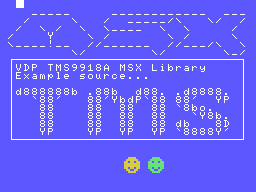

# VDP TMS9918A MSX BIOS SDCC Library (fR3eL Project)

<table>
<tr><td>Name</td><td>VDP_TMS9918A_MSXBIOS</td></tr>
<tr><td>Architecture</td><td>MSX</td></tr>
<tr><td>Environment</td><td>ROM, MSX BASIC</td></tr>
<tr><td>Format</td><td>SDCC Relocatable object file (.rel)</td></tr>
<tr><td>Programming language</td><td>C and Z80 assembler</td></tr>
<tr><td>Compiler</td><td>SDCC v4.4 or newer</td></tr>
</table>

 

## Description

C Library functions to work with the TMS9918A/28A/29A video processor.

This library contains a collection of functions for basic access to VDP capabilities, such as: 
initializing display modes, accessing registers, accessing video memory, and displaying sprites.

It uses MSX BIOS functions, so it is designed to develop applications in ROM or MSXBASIC environments, 
using the Small Device C Compiler [(SDCC)](http://sdcc.sourceforge.net/) cross compiler.

The advantage of using the BIOS is that the library is more compact and guarantees compatibility with all MSX models, but it has the disadvantage of being slow.

It also has an alternative library, [VDP_TMS9918A](https://github.com/mvac7/SDCC_VDP_TMS9918A_Lib), where all functions are programmed without using the MSX BIOS.
It is optimized to offer good performance with the VDP TMS9918A, especially for functions that work with VRAM.
It is designed for environments such as DOS or 48K ROMs, where direct access to the BIOS is not available (it is slower), 
although it is advisable for any environment that requires optimal access to VRAM.

You can complement it with any of these libraries:
- [VDP_PRINT](https://github.com/mvac7/fR3eL_VDP_PRINT_Lib) Library with functions for display text strings in the graphic modes of the TMS9918A (G1 and G2).
- [VDP_SPRITES_MSXBIOS](https://github.com/mvac7/fR3eL_VDP_SPRITES_MSXBIOS_Lib) Library with functions for directly accessing sprite attributes from the TMS9918A video processor.

You can access the documentation here with [`How to use the library`](docs/HOWTO.md).

These libraries are part of the [MSX fR3eL Project](https://github.com/mvac7/SDCC_MSX_fR3eL).

This project is open source under the [MIT license](LICENSE). 
You can add part or all of this code in your application development or include it in other libraries/engines.

Enjoy it!   

 

---

## History of versions
(dd/mm/yyyy)

- v1.5 (22/07/2025) Changes for the new version of the VDP_SPRITES library.
	- Added GetSPRattrVRAM function.
	- Added GetSpritePattern routine for Assembler Inline.
	- Added ReadByteFromVRAM and WriteByteToVRAM labels for Assembler Inline.
- v1.4 (12/06/2025)
	- Added PUTSPRITE function.
- v1.3 ( 1/12/2023) Update to SDCC (4.1.12) Z80 calling conventions.
- v1.2 (22/12/2020) Conversion to source in C and added Sprite initialization functions.
- v1.1 (14/02/2014)
- v1.0 (11/02/2014)

 

---

## Requirements

- [Small Device C Compiler (SDCC) v4.4](http://sdcc.sourceforge.net/)
- [Hex2bin v2.5](http://hex2bin.sourceforge.net/)

 

---

## Functions

### Initialization

| Name      | Declaration | Output | Description |
| :---      | :---        | :---   | :---        |
| SCREEN    | `SCREEN(mode)` | --- | Initializes the display |
| COLOR     | `COLOR(ink, background, border)` | --- | Set the foreground, background, and border screen colors |
| CLS       | `CLS()` | --- | Clear Screen. Fill VRAM Name Table with the value 0 |

 

### Access to the VDP Registers

| Name   | Declaration | Output | Description |
| :---   | :---        | :---   | :---        |
| GetVDP | `GetVDP(reg)`        | `char` | Gets the value in a VDP register. Provides the mirror value stored in system variables |
| SetVDP | `SetVDP(reg, value)` | ---    | Writes a value to a VDP register |

 

### Access to video memory

| Name | Declaration | Output | Description |
| ---  | ---         | ---    | ---         |
| VPOKE          | `VPOKE(vaddr, value)`   | --- | Writes a value to VRAM |
| VPEEK          | `VPEEK(vaddr)` | `char` | Reads a value from VRAM |
| FillVRAM       | `FillVRAM(vaddr, size, value)`    | --- | Fills an area of VRAM with the same value |
| CopyToVRAM     | `CopyToVRAM(addr, vaddr, size)`   | --- | Block transfer from memory to VRAM    |
| CopyFromVRAM   | `CopyFromVRAM(vaddr, addr, size)` | --- | Block transfer from VRAM to memory  |

 

### Access to Sprites

| Name | Declaration | Output | Description |
| ---  | ---         | ---    | ---         |
| SetSpritesSize  | `SetSpritesSize(size)` | --- | Set size type for the sprites |
| SetSpritesZoom  | `SetSpritesZoom(zoom)` | --- | Set zoom type for the sprites |
| ClearSprites    | `ClearSprites()` | --- | Initialises the Sprite Attribute Table (OAM) |
| PUTSPRITE       | `PUTSPRITE(plane, x, y, color, pattern)` | --- | Displays a sprite |
| GetSPRattrVRAM  | `GetSPRattrVRAM(plane)` | `unsigned int` | Gets the address in video memory of the Sprite attributes of specified plane |

 

---

## Examples
 
The project includes several examples that I have used to test the library and that can help you learn how to use this library.

You can find them in the [`examples/`](examples/) folder.

 

### Example 1 (ROM)

Example included in the HOWTO document.

[`examples/Example01`](examples/Example01)

 

 

### Example 2

This example tests all of the library's functions in the four screen modes of the TMS9918A.
Test the functionality of the library in a system environment for ROM (BIOS+ROM+RAM+RAM).

[`examples/Example02`](examples/Example02)

 
 

 

---

## Documentation

- Texas Instruments [TMS9918A application manual](http://map.grauw.nl/resources/video/texasinstruments_tms9918.pdf) `PDF`
- Texas Instruments [VDP Programmer’s Guide](http://map.grauw.nl/resources/video/ti-vdp-programmers-guide.pdf) `PDF`
- Texas Instruments [TMS9918A VDP](http://bifi.msxnet.org/msxnet/tech/tms9918a.txt) by Sean Young `TXT`
- The MSX Red Book · [2 Video Display Processor](https://github.com/gseidler/The-MSX-Red-Book/blob/master/the_msx_red_book.md#chapter_2) `HTML`
- YAMAHA [9938 Technical Data Book](http://map.grauw.nl/resources/video/v9938/v9938.xhtml) `HTML`

