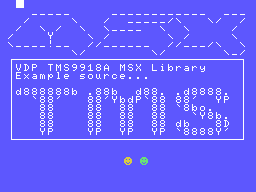

# How to use the VDP TMS9918A MSX BIOS Library

| Attention! |
| :---       |
| The following document has been written using an English translator.<br/>You can participate in the improvement of this document, transmitting your corrections or suggestions in the issues of this project or the main fR3eL project.<br/>Thanks for understanding. |

<br/>

## Index

- [1 Description](#1-Description)
- [2 Requirements](#2-Requirements)
- [3 Definitions](#3-Definitions)
    - [3.1 VDP Ports](#31-VDP-Ports)
	- [3.2 VDP Registers](#32-VDP-Registers)
	- [3.3 Screen Modes](#33-Screen-Modes)
	- [3.4 Sprite Sizes](#34-Sprite-Sizes)
	- [3.5 Sprite Zoom](#35-Sprite-Zoom)
	- [3.6 Color Names](#36-Color-Names)
	- [3.7 VDP base address tables](#37-VDP-base-address-tables)
	- [3.8 VDP base address tables 2 (BASE type)](#38-VDP-base-address-tables-2-(BASE-type))
	- [3.9 G2 Tileset Bank addends](#39-G2-Tileset-Bank-addends)
- [4 Functions](#4-Functions)
	- [4.1 SCREEN](#41-SCREEN)
	- [4.2 CLS](#42-CLS)
	- [4.3 COLOR](#43-COLOR)
	- [4.4 VPOKE](#44-VPOKE)
	- [4.5 VPEEK](#45-VPEEK)
	- [4.6 FillVRAM](#46-FillVRAM)
	- [4.7 CopyToVRAM](#47-CopyToVRAM)
	- [4.8 CopyFromVRAM](#48-CopyFromVRAM)
	- [4.9 GetVDP](#49-GetVDP)
	- [4.10 SetVDP](#410-SetVDP)	
	- [4.11 SetSpritesSize](#411-SetSpritesSize)
	- [4.12 SetSpritesZoom](#412-SetSpritesZoom)
	- [4.13 ClearSprites](#413-ClearSprites)
	- [4.14 PUTSPRITE](#414-PUTSPRITE)	
- [5 Examples](#5-Examples)
- [6 References](#6-References)

<br/>

---


## 1 Description

Library with basic functions to work with the TMS9918A/28A/29A video processor.

Since the current version you can display moving figures (Sprites), using the PUTSPRITE function (similar to MSX-BASIC), but you also have the [VDP_SPRITES_MSXBIOS](https://github.com/mvac7/SDCC_VDP_SPRITES_MSXROM_Lib) library that improves the management of Sprite parameters.

You also have the [VDP_PRINT](https://github.com/mvac7/SDCC_VDP_PRINT_Lib) library with functions for display text strings in the graphic modes of the TMS9918A (G1 and G2).

You also have a [VDP_TMS9918A](https://github.com/mvac7/SDCC_VDP_TMS9918A_Lib) library where all functions are programmed without using the BIOS. 
It is designed for use in environments such as DOS or 48K ROMs, although you can also use it in other environments such as ROMs or MSX-BASIC. 
The advantage of using the BIOS is that the library is more compact and guarantees compatibility between different MSX models, but it has the disadvantage of being slow.

It uses MSX BIOS functions, so it is designed to develop applications in ROM or MSXBASIC environments, using the Small Device C Compiler [(SDCC)](http://sdcc.sourceforge.net/) cross compiler.

You can access the documentation here with [`How to use the library`](docs/HOWTO.md).

These libraries are part of the [MSX fR3eL Project](https://github.com/mvac7/SDCC_MSX_fR3eL).

This project is open source under the [MIT license](LICENSE). 
You can add part or all of this code in your application development or include it in other libraries/engines.

<br/>

---


## 2 Requirements

- [Small Device C Compiler (SDCC) v4.4](http://sdcc.sourceforge.net/)
- [Hex2bin v2.5](http://hex2bin.sourceforge.net/)

<br/>

---


## 3 Definitions

### 3.1 VDP Ports

Label		| Value
:---		| :---
VDPVRAM		| 0x98
VDPSTATUS	| 0x99

<br/>

### 3.2 VDP Registers

Label	| Value
:---	| :---
VDP_Mode0		| 0
VDP_Mode1		| 1
VDP_BGmap		| 2
VDP_BGcolors	| 3
VDP_BGtiles		| 4
VDP_OBJattr		| 5
VDP_OBJtiles	| 6
VDP_Color		| 7

<br/>

### 3.3 Screen Modes

To use them in the SCREEN(mode) function.

Label		| Value | MSX BASIC	| Description
:---		| ---:	| :---		| :---
TEXT1		| 0		| SCREEN 0	| Text mode 40col
GRAPHIC1	| 1		| SCREEN 1	| Graphics 1 mode
GRAPHIC2	| 2		| SCREEN 2	| Graphics 2 mode
MULTICOLOR	| 3		| SCREEN 3	| Multicolor mode 64x48 blocks

<br/>

### 3.4 Sprite Sizes

Label			| Value
:---			| ---:
SPRITES8x8		| 0
SPRITES16x16	| 1

<br/>

### 3.5 Sprite Zoom

Label			| Value
:---			| ---:
SPRITESzoomX1	| 0
SPRITESzoomX2	| 1

<br/>

### 3.6 Color Names

Label		| Value
:---		| ---:
TRANSPARENT	| 0
BLACK		| 1
GREEN		| 2
LIGHT_GREEN	| 3
DARK_BLUE	| 4
LIGHT_BLUE	| 5
DARK_RED	| 6
CYAN		| 7
RED			| 8
LIGHT_RED	| 9
DARK_YELLOW	| 10
LIGHT_YELLOW	| 11
DARK_GREEN	| 12
MAGENTA		| 13
GRAY		| 14
WHITE		| 15

<br/>

### 3.7 VDP base address tables 1
Definition of the video memory addresses where the different graphic data tables are located.

<table>
<tr><th align="left">**Notes:**</th></tr>
<tr><td>These addresses are those used by default by the MSX system.</td></tr>
<tr><td>The sprite pattern and attribute tables are the same for GRAPHIC1, GRAPHIC2, and Multicolor modes.</td></tr>
</table>

Label	| Value	| Description
:---	| :---	| :---
T1_MAP	| 0x0000	| T1 Name Table
T1_PAT	| 0x0800	| T1 Pattern Table
G1_MAP	| 0x1800	| G1 Name Table
G1_PAT	| 0x0000	| G1 Pattern Table
G1_COL	| 0x2000	| G1 Color Table
G2_MAP	| 0x1800	| G2 Name Table
G2_PAT	| 0x0000	| G2 Pattern Table
G2_PAT_A	| 0x0000	| G2 Pattern Table Bank A
G2_PAT_B	| 0x0800	| G2 Pattern Table Bank B
G2_PAT_C	| 0x1000	| G2 Pattern Table Bank C
G2_COL	| 0x2000	| G2 Color Table
G2_COL_A	| 0x2000	| G2 Color Table Bank A
G2_COL_B	| 0x2800	| G2 Color Table Bank B
G2_COL_C	| 0x3000	| G2 Color Table Bank C
MC_MAP	| 0x0800	| MC Name Table
MC_PAT	| 0x0000	| MC Pattern Table <br/> (A tile contains the color data of 2x2 blocks)
SPR_OAM	| 0x1B00	| Sprite Attribute Table (Object Attribute Memory)
SPR_PAT	| 0x3800	| Sprite Pattern Table

<br/>

#### Example:

```c
	//Copy a tileset patterns to the three banks of the Screen2 graphic mode
	CopyToVRAM((unsigned int) TilesetDATA_PAT,G2_PAT_A,0x800);
	CopyToVRAM((unsigned int) TilesetDATA_PAT,G2_PAT_B,0x800);
	CopyToVRAM((unsigned int) TilesetDATA_PAT,G2_PAT_C,0x800);
```

<br/>

### 3.8 VDP base address tables 2 (BASE type)

Definition of the video memory addresses where the different graphic data tables are located.
Based on the BASE instruction of MSX BASIC.
**Note:** These addresses are those used by default by the MSX system.

__***OAM** = Object Attribute Memory__

<br/>

#### Screen0 T1 TXT40
Label	| Value		| Description
:---	| :---		| :---
BASE0	| 0x0000	| Name Table
BASE2	| 0x0800	| Pattern Table

#### Screen1 G1 TXT32
Label	| Value		| Description
:---	| :---		| :---
BASE5	| 0x1800	| Name Table
BASE6	| 0x2000	| Color Table
BASE7	| 0x0000	| Pattern Table
BASE8	| 0x1B00	| Sprite Attribute Table (OAM)
BASE9	| 0x3800	| Sprite Pattern Table

#### Screen2 G2 GRAPH1
Label	| Value		| Description
:---	| :---		| :---
BASE10	| 0x1800	| Name Table
BASE11	| 0x2000	| Color Table
BASE12	| 0x0000	| Pattern Table
BASE13	| 0x1B00	| Sprite Attribute Table (OAM)
BASE14	| 0x3800	| Sprite Pattern Table

#### Screen3 MC GRAPH2
Label	| Value		| Description
:---	| :---		| :---
BASE15	| 0x0800	| Name Table
BASE17	| 0x0000	| Pattern Table
BASE18	| 0x1B00	| Sprite Attribute Table (OAM)
BASE19	| 0x3800	| Sprite Pattern Table

<br/>

### 3.9 G2 Tileset Bank addends
Labels to facilitate the positioning of the tileset banks in G2 mode.

Label	| Value
:---	| :---
BANK0	| 0x0000
BANK1	| 0x0800
BANK2	| 0x1000

<br/>

#### Example:

```c
	//Copy a tileset patterns to the three banks of the Screen2 graphic mode
	CopyToVRAM((unsigned int) TilesetDATA_PAT,BASE12+BANK0,0x800);
	CopyToVRAM((unsigned int) TilesetDATA_PAT,BASE12+BANK1,0x800);
	CopyToVRAM((unsigned int) TilesetDATA_PAT,BASE12+BANK2,0x800);
```

<br/>

---


## 4 Functions

#### 4.1 SCREEN

<table>
<tr><th colspan=3 align="left">SCREEN</th></tr>
<tr><td colspan=3>Initializes the display to one of the four standardized modes on the MSX.<br/>Same as the SCREEN instruction in MSX BASIC.</td></tr>
<tr><th>Function</th><td colspan=2>SCREEN(char mode)<td></tr>
<tr><th>Input</th><td>char</td><td>Screen mode (0-3)</td></tr>
<tr><th>Output</th><td colspan=2>-</td></tr>
</table>

##### Examples:

```c
	SCREEN(2);
```

```c
	SCREEN(GRAPHIC1);
```

<br/>

#### 4.2 CLS

<table>
<tr><th colspan=3 align="left">CLS</th></tr>
<tr><td colspan=3>Clear Screen. Fills the Name Table with the value 0.<br/>Note: Does not hide Sprite planes.</td></tr>
<tr><th>Function</th><td colspan=2>CLS()</td></tr>
<tr><th>Input</th><td colspan=2>-</td></tr>
<tr><th>Output</th><td colspan=2>-</td></tr>
</table>

##### Example:

```c
	CLS();
```

<br/>

#### 4.3 COLOR

<table>
<tr><th colspan=3 align="left">COLOR</th></tr>
<tr><td colspan=3>
Set the foreground, background, and border screen colors.<br/>This function has different behaviors depending on the screen mode.<br/>
In Text1 mode, the color change is instantaneous except the border color which has no effect.<br/>
In GRAPHIC1, GRAPHIC2 and Multicolor modes, only the border color has an instant effect.<br/>
Ink and background colors are only used when starting the screen with the SCREEN() function.
</td></tr>
<tr><th>Function</th><td colspan=2>COLOR(char ink, char BG, char border)<td></tr>
<tr><th rowspan=3>Input</th><td>char</td><td>Ink color (0-15)</td></tr>
<tr><td>char</td><td>Background color (0-15)</td></tr>
<tr><td>char</td><td>Border color (0-15)</td></tr>
<tr><th>Output</th><td colspan=2>-</td></tr>
</table>

##### Examples:

```c
	COLOR(1,14,15);
	SCREEN(0);
```

```c
	COLOR(GRAY,DARK_BLUE,LIGHT_BLUE);
	SCREEN(GRAPHIC1);
```

<br/>

#### 4.4 VPOKE

<table>
<tr><th colspan=3 align="left">VPOKE</th></tr>
<tr><td colspan=3>Writes a value to the video RAM.</td></tr>
<tr><th>Function</th><td colspan=2>VPOKE(char value, unsigned int VRAMaddr)<td></tr>
<tr><th rowspan=2>Input</th><td>char</td><td>Value</td></tr>
<tr><td>unsigned int</td><td>VRAM address</td></tr>
<tr><th>Output</th><td colspan=2>-</td></tr>
</table>


| Warning!	|
| :---		|
| The order of the values has been reversed to optimize the function taking advantage of the new SDCC Z80 calling conventions. |

##### Example:

```c
	VPOKE(1,0x1000);
	VPOKE(0xFF,0x1001);
```

<br/>

#### 4.5 VPEEK

<table>
<tr><th colspan=3 align="left">VPEEK</th></tr>
<tr><td colspan=3>Reads a value from the video RAM.</td></tr>
<tr><th>Function</th><td colspan=2>VPEEK(unsigned int VRAMaddr)<td></tr>
<tr><th>Input</th><td>unsigned int</td><td>VRAM address</td></tr>
<tr><th>Output</th><td>char</td><td>Value</td></tr>
</table>

##### Example:

```c
	char value;<br/>
	value=VPEEK(SPR_OAM);
```

<br/>

#### 4.6 FillVRAM

<table>
<tr><th colspan=3 align="left">FillVRAM</th></tr>
<tr><td colspan=3>Fill a large area of the VRAM of the same byte.</td></tr>
<tr><th>Function</th><td colspan=2>FillVRAM(unsigned int VRAMaddr, unsigned int size, char value)<td></tr>
<tr><th rowspan=3>Input</th><td>unsigned int</td><td>VRAM address</td></tr>
<tr><td>unsigned int</td><td>blocklength</td></tr>
<tr><td>char</td><td>Value</td></tr>
<tr><th>Output</th><td colspan=2>-</td></tr>
</table>

##### Example:

```c
	FillVRAM(G1_MAP,0x300,32);
```

<br/>

#### 4.7 CopyToVRAM

<table>
<tr><th colspan=3 align="left">CopyToVRAM</th></tr>
<tr><td colspan=3>Block transfer from memory to VRAM.</td></tr>
<tr><th>Function</th><td colspan=2>CopyToVRAM(unsigned int MEMaddr, unsigned int VRAMaddr, unsigned int size)<td></tr>
<tr><th rowspan=3>Input</th><td>unsigned int</td><td>Memory address</td></tr>
<tr><td>unsigned int</td><td>VRAM address</td></tr>
<tr><td>unsigned int</td><td>blocklength</td></tr>
<tr><th>Output</th><td colspan=2>-</td></tr>
</table>

##### Example:

```c
	const char test_MAP[]={0x00,0x20,0x20,0x20,0x5F,0x5F,0x5F,0x5F,0x5F,0x20,0x20,0x20,0x20,0x20,
	0x5F,0x5F,0x5F,0x5F,0x5F,0x5F,0x5F,0x5F,0x5F,0x5F,0x5F,0x5F,0x20,0x20,0x5F,0x5F,0x5F,0x00};
	CopyToVRAM((unsigned int) test_MAP,G1_MAP,32);
```

<br/>

#### 4.8 CopyFromVRAM

<table>
<tr><th colspan=3 align="left">CopyFromVRAM</th></tr>
<tr><td colspan=3>Block transfer from VRAM to RAM.</td></tr>
<tr><th>Function</th><td colspan=2>CopyFromVRAM(unsigned int VRAMaddr, unsigned int RAMaddr, unsigned int size)<td></tr>
<tr><th rowspan=3>Input</th><td>unsigned int</td><td>VRAM address</td></tr>
<tr><td>unsigned int</td><td>RAM address</td></tr>
<tr><td>unsigned int</td><td>blocklength</td></tr>
<tr><th>Output</th><td colspan=2>-</td></tr>
</table>

##### Example:

```c
	CopyFromVRAM(SPR_OAM,0xD000,32*4);
```

<br/>

#### 4.9 GetVDP

<table>
<tr><th colspan=3 align="left">GetVDP</th></tr>
<tr><td colspan=3>Gets the value in a VDP register.<br/>Provides the mirror value stored in system variables.</td></tr>
<tr><th>Function</th><td colspan=2>GetVDP(char register)<td></tr>
<tr><th>Input</th><td>char</td><td>VDP register number (0-7)</td></tr>
<tr><th>Output</th><td>char</td><td>Value</td></tr>
</table>

##### Example:

```c
	char A=GetVDP(VDP_Mode1);
	SetVDP(VDP_Mode1,A & 0b10111111); //BLK Disable
```

<br/>


#### 4.10 SetVDP

<table>
<tr><th colspan=3 align="left">SetVDP</th></tr>
<tr><td colspan=3>Writes a value to a VDP register.</td></tr>
<tr><th>Function</th><td colspan=2>SetVDP(char register, char value)<td></tr>
<tr><th rowspan=2>Input</th><td>char</td><td>VDP register (0-7)</td></tr>
<tr><td>char</td><td>value</td></tr>
<tr><th>Output</th><td colspan=2>-</td></tr>
</table>

##### Example:

```c
	char A=GetVDP(VDP_Mode1);
	SetVDP(VDP_Mode1,A | 0b01000000); //BLK Enable
```

<br/>


#### 4.11 SetSpritesSize

<table>
<tr><th colspan=3 align="left">SetSpritesSize</th></tr>
<tr><td colspan=3>Set size type for the sprites.</td></tr>
<tr><th>Function</th><td colspan=2>SetSpritesSize(char size)</td></tr>
<tr><th>Input</th><td>char</td><td>Size (0=8x8; 1=16x16)</td></tr>
<tr><th>Output</th><td colspan=2>-</td></tr>
</table>

##### Examples:

```c
	SetSpritesSize(0);	//8x8
```

```c
	SetSpritesSize(SPRITES16x16);
```

<br/>

#### 4.12 SetSpritesZoom

<table>
<tr><th colspan=3 align="left">SetSpritesZoom</th></tr>
<tr><td colspan=3>Set zoom type for the sprites.</td></tr>
<tr><th>Function</th><td colspan=2>SetSpritesZoom(char zoom)</td></tr>
<tr><th>Input</th><td>char or boolean or switcher</td><td>zoom: 0/false/OFF = x1; 1/true/ON = x2</td></tr>
<tr><th>Output</th><td colspan=2>-</td></tr>
</table>

| Note: |
| :---  |
| To be able to use `boolean` or `switcher` types, you need to include [newTypes.h](https://github.com/mvac7/SDCC_MSX_fR3eL/blob/main/include/newTypes.h) in your source code. |

##### Examples:

```c
	SetSpritesSize(0);	//size 8x8
	SetSpritesZoom(0);	//zoom x1 (without zoom)
```

```c
	SetSpritesSize(SPRITES16x16);
	SetSpritesZoom(SPRITESzoomX2);
```

```c
	SetSpritesZoom(ON);	//zoom x2
```

<br/>

#### 4.13 ClearSprites

<table>
<tr><th colspan=3 align="left">ClearSprites</th></tr>
<tr><td colspan=3>Initialises the Sprite Attribute Table (OAM) and Sprite Pattern Table.</td></tr>
<tr><th>Function</th><td colspan=2>ClearSprites()</td></tr>
<tr><th>Input</th><td colspan=2>-</td></tr>
<tr><th>Output</th><td colspan=2>-</td></tr>
</table>

##### Example:

```c
	ClearSprites();
	CLS();
```

| Note: |
| :---  |
| This function clears all sprite data. 
If you simply want to hide all sprites on the screen, you can use a feature of the VDP: vertical position 208. 
When we set a plane to this position, the VDP ignores the display of the rest of the sprites. 
So, if we set plane 0 to position 208, we will hide all sprites on the screen. |

<br/>

#### 4.14 PUTSPRITE

<table>
<tr><th colspan=3 align="left">PUTSPRITE</th></tr>
<tr><td colspan=3>Displays a Sprite on the screen.</td></tr>
<tr><th>Function</th><td colspan=2>PUTSPRITE(char plane, char x, char y, char color, char pattern)</td></tr>
<tr><th rowspan=5>Input</th><td>char</td><td>sprite plane (0-31)</td></tr>
<tr><td>char</td><td>X coordinate</td></tr>
<tr><td>char</td><td>Y coordinate</td></tr>
<tr><td>char</td><td>Color (0-15)</td></tr>
<tr><td>char</td><td>pattern number</td></tr>
<tr><th>Output</th><td colspan=2>-</td></tr>
</table>

##### Example:

```c
	PUTSPRITE(1,140,156,LIGHT_GREEN,0);	//Put Sprite 0 on plane 1 at coordinates (140,156)
```

<br/>

---

## 5 Examples
 
### Example 1

In this source code you will find a simple example of how to use this library.

Requires the following items:
- Startup file for MSX 8/16K ROM [crt0_MSX816kROM4000](https://github.com/mvac7/SDCC_startup_MSX816kROM4000)
- [VDP_TMS9918A_MSXBIOS Library](https://github.com/mvac7/SDCC_VDP_TMS9918A_MSXROM_Lib)

<br/>

And you need the following applications to compile and generate the final ROM:
- [Small Device C Compiler (SDCC) v4.4](http://sdcc.sourceforge.net/)
- [Hex2bin v2.5](http://hex2bin.sourceforge.net/)

<br/>

This example performs the following actions:
1. Initializes the screen to Graphic1 mode (Screen 1) with 16x16 sprites in 2x zoom mode.
1. Dumps the data from the testmap_MAP array to the VRAM Pattern Name Table using the `CopyToVRAM` function.
1. Copy a pattern from VRAM to RAM using the `CopyFromVRAM` function.
1. Copy the pattern to the Sprite Pattern Table (from RAM to VRAM).
1. Display a Sprite by writing directly to the VRAM Sprite Attribute Table using the `VPOKE` function.
1. Display a Sprite using the `PUTSPRITE` function.

<br/>




#### Source code:

```c
/* =============================================================================
Example01.c
Version: 1.0 (20/May/2025)
Architecture: MSX
Format: MSX ROM 8k
Programming language: C and Z80 assembler
Compiler: SDCC 4.4 or newer

Description:
Simple example of the VDP TMS9918A MSX BIOS Library (fR3eL Project)
============================================================================= */
#include "VDP_TMS9918A_MSXBIOS.h"


// tMSgfX devtool v0.9.16.0
// Map width:32 height:17
// Size=544
const char testmap_MAP[]={
0x00,0x20,0x20,0x20,0x5F,0x5F,0x5F,0x5F,0x5F,0x20,0x20,0x20,0x20,0x20,0x5F,0x5F,
0x5F,0x5F,0x5F,0x5F,0x5F,0x5F,0x5F,0x5F,0x5F,0x5F,0x20,0x20,0x5F,0x5F,0x5F,0x00,
0x00,0x20,0x20,0x2F,0x20,0x20,0x20,0x20,0x20,0x5C,0x20,0x20,0x20,0x2F,0x20,0x20,
0x5F,0x5F,0x5F,0x5F,0x5F,0x2F,0x5C,0x20,0x20,0x20,0x5C,0x2F,0x20,0x20,0x2F,0x00,
0x00,0x20,0x2F,0x20,0x20,0x5C,0x20,0x2F,0x20,0x20,0x5C,0x20,0x20,0x5C,0x5F,0x5F,
0x5F,0x5F,0x20,0x20,0x5C,0x20,0x20,0x5C,0x20,0x20,0x20,0x20,0x20,0x2F,0x20,0x00,
0x00,0x2F,0x20,0x20,0x20,0x20,0x59,0x20,0x20,0x20,0x20,0x5C,0x20,0x2F,0x20,0x20,
0x20,0x20,0x20,0x20,0x20,0x5C,0x20,0x2F,0x20,0x20,0x20,0x20,0x20,0x5C,0x20,0x00,
0x00,0x5C,0x5F,0x5F,0x5F,0x5F,0x21,0x5F,0x5F,0x20,0x20,0x2F,0x2F,0x5F,0x5F,0x5F,
0x5F,0x5F,0x5F,0x20,0x20,0x2F,0x2F,0x5F,0x5F,0x5F,0x2F,0x5C,0x20,0x20,0x5C,0x00,
0x00,0x20,0x20,0x20,0x20,0x20,0x20,0x20,0x20,0x5C,0x2F,0x20,0x20,0x20,0x20,0x20,
0x20,0x20,0x20,0x5C,0x2F,0x20,0x20,0x20,0x20,0x20,0x20,0x20,0x5C,0x5F,0x2F,0x00,
0x20,0x18,0x17,0x17,0x17,0x17,0x17,0x17,0x17,0x17,0x17,0x17,0x17,0x17,0x17,0x17,
0x17,0x17,0x17,0x17,0x17,0x17,0x17,0x17,0x17,0x17,0x17,0x17,0x17,0x17,0x19,0x20,
0x20,0x16,0x56,0x44,0x50,0x20,0x54,0x4D,0x53,0x39,0x39,0x31,0x38,0x41,0x20,0x4D,
0x53,0x58,0x20,0x4C,0x69,0x62,0x72,0x61,0x72,0x79,0x20,0x20,0x20,0x20,0x16,0x20,
0x20,0x16,0x45,0x78,0x61,0x6D,0x70,0x6C,0x65,0x20,0x73,0x6F,0x75,0x72,0x63,0x65,
0x2E,0x2E,0x2E,0x20,0x20,0x20,0x20,0x20,0x20,0x20,0x20,0x20,0x20,0x20,0x16,0x20,
0x20,0x16,0x20,0x20,0x20,0x20,0x20,0x20,0x20,0x20,0x20,0x20,0x20,0x20,0x20,0x20,
0x20,0x20,0x20,0x20,0x20,0x20,0x20,0x20,0x20,0x20,0x20,0x20,0x20,0x20,0x16,0x20,
0x20,0x16,0x64,0x38,0x38,0x38,0x38,0x38,0x38,0x62,0x20,0x2E,0x38,0x38,0x62,0x20,
0x20,0x64,0x38,0x38,0x2E,0x20,0x2E,0x64,0x38,0x38,0x38,0x38,0x2E,0x20,0x16,0x20,
0x20,0x16,0x20,0x20,0x60,0x38,0x38,0x27,0x20,0x20,0x20,0x38,0x38,0x27,0x59,0x62,
0x64,0x50,0x60,0x38,0x38,0x20,0x38,0x38,0x27,0x20,0x20,0x59,0x50,0x20,0x16,0x20,
0x20,0x16,0x20,0x20,0x20,0x38,0x38,0x20,0x20,0x20,0x20,0x38,0x38,0x20,0x20,0x38,
0x38,0x20,0x20,0x38,0x38,0x20,0x60,0x38,0x62,0x6F,0x2E,0x20,0x20,0x20,0x16,0x20,
0x20,0x16,0x20,0x20,0x20,0x38,0x38,0x20,0x20,0x20,0x20,0x38,0x38,0x20,0x20,0x38,
0x38,0x20,0x20,0x38,0x38,0x20,0x20,0x20,0x60,0x59,0x38,0x62,0x2E,0x20,0x16,0x20,
0x20,0x16,0x20,0x20,0x20,0x38,0x38,0x20,0x20,0x20,0x20,0x38,0x38,0x20,0x20,0x38,
0x38,0x20,0x20,0x38,0x38,0x20,0x64,0x62,0x20,0x20,0x20,0x38,0x44,0x20,0x16,0x20,
0x20,0x16,0x20,0x20,0x20,0x59,0x50,0x20,0x20,0x20,0x20,0x59,0x50,0x20,0x20,0x59,
0x50,0x20,0x20,0x59,0x50,0x20,0x60,0x38,0x38,0x38,0x38,0x59,0x27,0x20,0x16,0x20,
0x20,0x1A,0x17,0x17,0x17,0x17,0x17,0x17,0x17,0x17,0x17,0x17,0x17,0x17,0x17,0x17,
0x17,0x17,0x17,0x17,0x17,0x17,0x17,0x17,0x17,0x17,0x17,0x17,0x17,0x17,0x1B,0x20};


void main(void) 
{
	unsigned int vaddr = SPR_OAM;
	char TheSprite[8];			//buffer for one Sprite patter
		
	COLOR(15,4,5);
 	SCREEN(GRAPHIC1);			// Set Screen 1
	SetSpritesSize(SPRITES8x8);
	
	// Copy a block of characters (tiles) to VRAM Name Table
	CopyToVRAM((unsigned int) testmap_MAP,G1_MAP+32,544);
	
	// Copy a 8x8 tile Pattern to Sprite Pattern Table
	CopyFromVRAM(G1_PAT+16,(unsigned int) TheSprite,8);	//Copy VRAM to RAM
	CopyToVRAM((unsigned int) TheSprite,SPR_PAT,8);		//Copy RAM to VRAM
	
	// Put Sprite 0 on plane 0
	VPOKE(vaddr++,156);			//y
	VPOKE(vaddr++,124);			//x
	VPOKE(vaddr++,0);			//sprite pattern
	VPOKE(vaddr,DARK_YELLOW);	//color
	
	PUTSPRITE(1,140,156,LIGHT_GREEN,0);	//Put Sprite 0 on plane 1 at coordinates (140,156)

	// execute BIOS CHGET - One character input (waiting)
__asm call 0x009F __endasm;	
}
```

<br/>

#### For compile:

To obtain a binary with the ROM of the example program, execute the following steps in a Windows command line (CMD):

1. Compile with SDCC

```
sdcc -mz80 --code-loc 0x4020 --data-loc 0xC000 --use-stdout --no-std-crt0 crt0_MSX816kROM4000.rel VDP_TMS9918A.rel Example01.c
```

<br/>

2. If the compiler has not displayed an error then convert the .ihx file to binary with hex2bin

```
hex2bin -e bin -l 2000 Example01.ihx
```

<br/>

3. Rename the binary to .ROM

```
rename Example01.bin EXAMPLE1.ROM
```

<br/>

---

## 6 References
  
- Texas Instruments [TMS9918A application manual](http://map.grauw.nl/resources/video/texasinstruments_tms9918.pdf) `PDF`
- Texas Instruments [VDP Programmer’s Guide](http://map.grauw.nl/resources/video/ti-vdp-programmers-guide.pdf) `PDF`
- Texas Instruments [TMS9918A VDP](http://bifi.msxnet.org/msxnet/tech/tms9918a.txt) by Sean Young `TXT`
- The MSX Red Book · [2 Video Display Processor](https://github.com/gseidler/The-MSX-Red-Book/blob/master/the_msx_red_book.md#chapter_2) `HTML`
- YAMAHA [9938 Technical Data Book](http://map.grauw.nl/resources/video/v9938/v9938.xhtml) `HTML`

<br/>

---

 
<br/>This document is licensed under a [Creative Commons Attribution-NonCommercial 4.0 International License](http://creativecommons.org/licenses/by-nc/4.0/).
